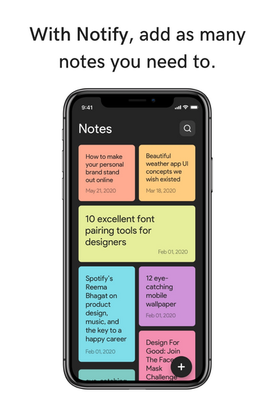
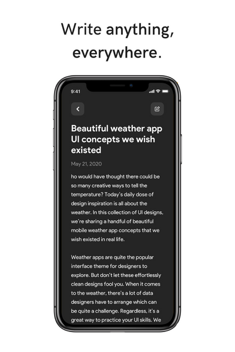
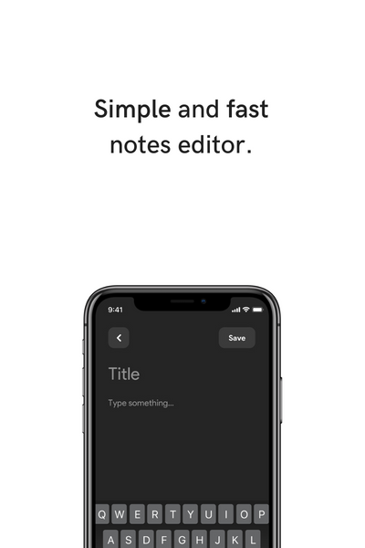

<div align="center">

  
  
  
  
  
  
  
  
  
  
  
  
  
  

  <h2 align="center">Notify, a cross-platform notes app. - Proyect by: Josue Fischer</h2>

</div>

#  Notify

Organize your thoughts and ideas, plan a big event, simplify planning important moments in your life with the Notify app. Start taking notes on your phone with Notify. Simple, colorful and fast.


| **Platform:** | Android |  iOS |
| ------------- | ------- | ---- |
| **Support:**  |    ✓    |  ✓  |

## Notify previews






## Main features

- [x] Create, update and delete notes 📝
- [x] Colorful notes that change their color 🌈
- [x] Search your notes by title 🔍
- [x] Supported languajes: en, pl 🔠

## Packages used

- equatable
- flutter_bloc
- flutter_staggered_grid_view
- intl
- json_annotation
- sqflite
- uuid

## Download the last version of Notify for Android

 

- [x] You can download the Notify official APK by clicking [here](https://github.com/iamjosuefischer/notify/releases "Download the official Notify APK")

## Run Locally

### Prerequisites

Before you begin, ensure you have met the following requirements:

* [Git](https://git-scm.com/downloads "Download Git") must be installed on your operating system.

### To run **Notify** locally, install the fllowing tools and run those commands on your git bash and terminal:

### 1. Install flutter
https://docs.flutter.dev/get-started/install

### 2. Clone this project
Linux and macOS:

```bash
sudo git clone https://github.com/iamjosuefischer/notify.git
```

Windows:

```bash
git clone https://github.com/iamjosuefischer/notify.git
```

### 3. Get dependencies
```bash
$ flutter pub get
```

### 4. Run locally
```bash
$ flutter run
```

### License

This project contains an **GPL-3.0 license.**


                    GNU GENERAL PUBLIC LICENSE
                       Notify, 23 August 2022

             Notify  Copyright (C) 2022  Josue Fischer
             
     The Notify App has no warranty for any platform,        
     everyone is permitted to distribute the Notify application,
     but change, copy or modify the Notify source code it is not allowed,
     you can´t distribute a Notify copy or a Notify modifycated application,
     you can only do that for personal testing use, but not for commercial use.
